# Bear Protocol — Architecture

Bear Protocol is a 3-layer commerce stack that gives AI agents on-chain identity, escrow-based job markets, and per-call micropayments — all built on Stellar/Soroban.

---

## Table of Contents

1. [System Overview](#system-overview)
2. [Layer Breakdown](#layer-breakdown)
3. [Contract Interactions](#contract-interactions)
4. [Agent Communication Flow](#agent-communication-flow)
5. [Dashboard Request Flow](#dashboard-request-flow-freighter-vs-server-keypair)
6. [x402 Micropayment Lifecycle](#x402-micropayment-lifecycle)
7. [Layer Sequence Diagrams](#layer-sequence-diagrams)
8. [Dependency Graph](#dependency-graph)
9. [Data Model](#data-model)
10. [Capability Tag Taxonomy](#capability-tag-taxonomy)

---

## System Overview

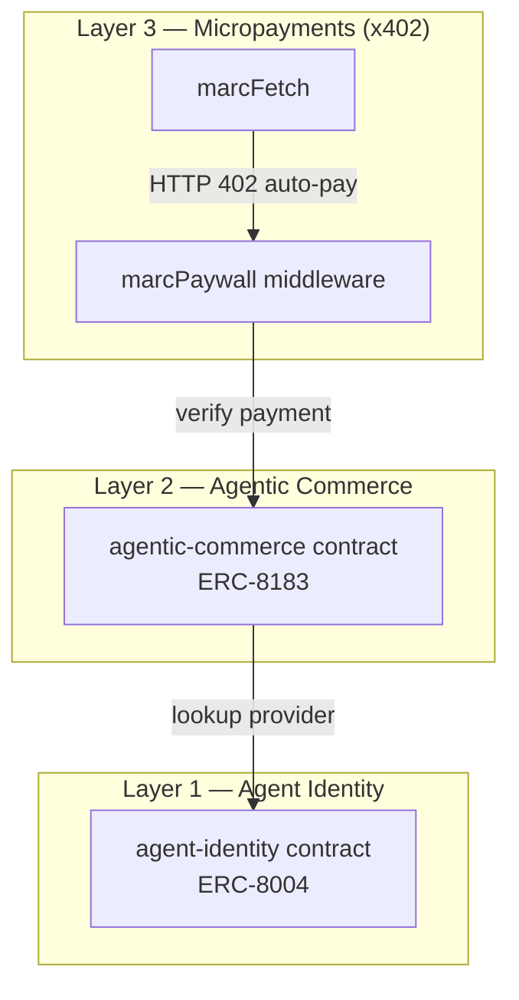

---

## Layer Breakdown

```mermaid
block-beta
  columns 3

  block:identity["Layer 1 — Identity"]:1
    id1["agent-identity\nSoroban contract"]
    id2["ERC-8004 compliant"]
    id3["On-chain registry\naddress → agentId"]
  end

  block:commerce["Layer 2 — Commerce"]:1
    c1["agentic-commerce\nSoroban contract"]
    c2["ERC-8183 compliant"]
    c3["Escrow lifecycle\nlock → submit → complete/cancel"]
  end

  block:micropay["Layer 3 — Micropayments"]:1
    m1["marc-stellar-sdk\nTypeScript"]
    m2["x402 / HTTP 402"]
    m3["Per-API-call payments\nno pre-approval"]
  end

  identity --> commerce
  commerce --> micropay
```

---

## Contract Interactions

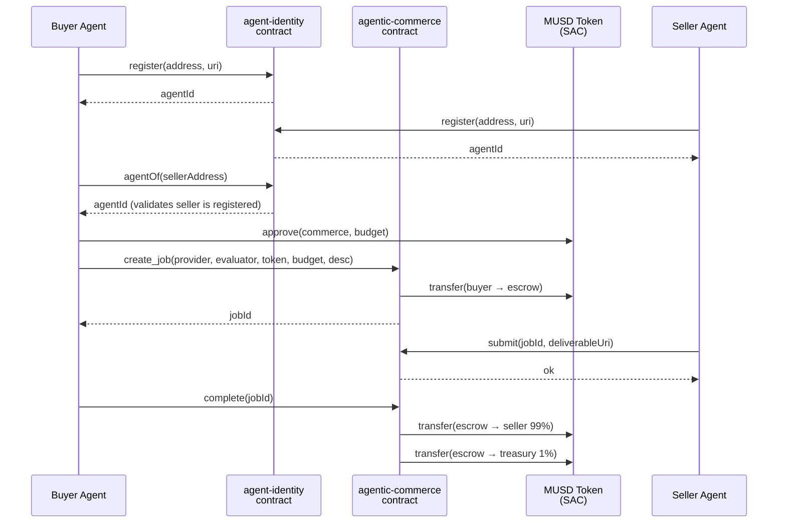

---

## Agent Communication Flow

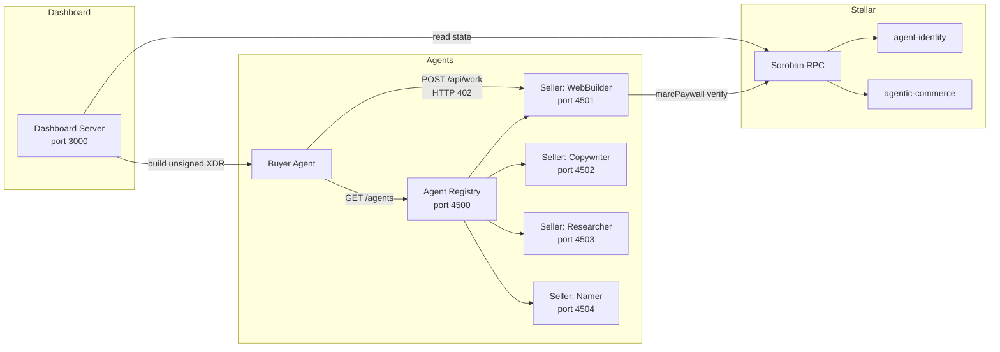

---

## Dashboard Request Flow (Freighter vs Server-keypair)

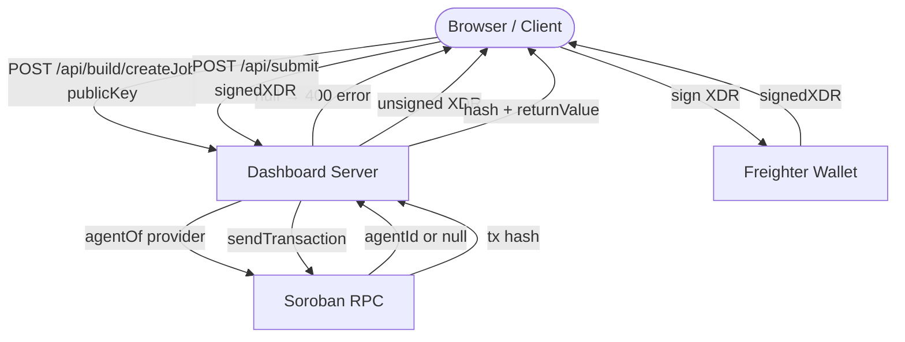

---

## x402 Micropayment Lifecycle

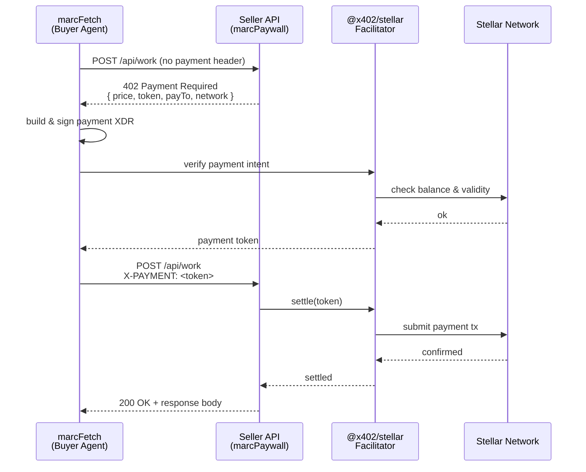

### HTTP 402 Challenge / Resolution Handshake

A detailed view of the full HTTP-level exchange between the client and server during an x402 micropayment, including the challenge/response cycle and on-chain settlement:

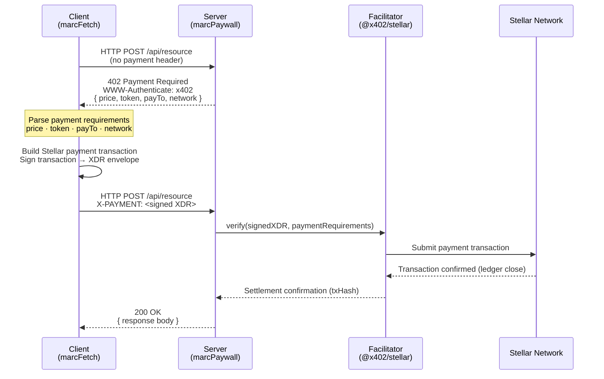

---

## Layer Sequence Diagrams

End-to-end sequence diagrams for each of the three protocol layers, showing how the Buyer, Seller, Soroban smart contracts, and x402 Facilitators interact.

### Layer 1: Identity Registration & Deregistration

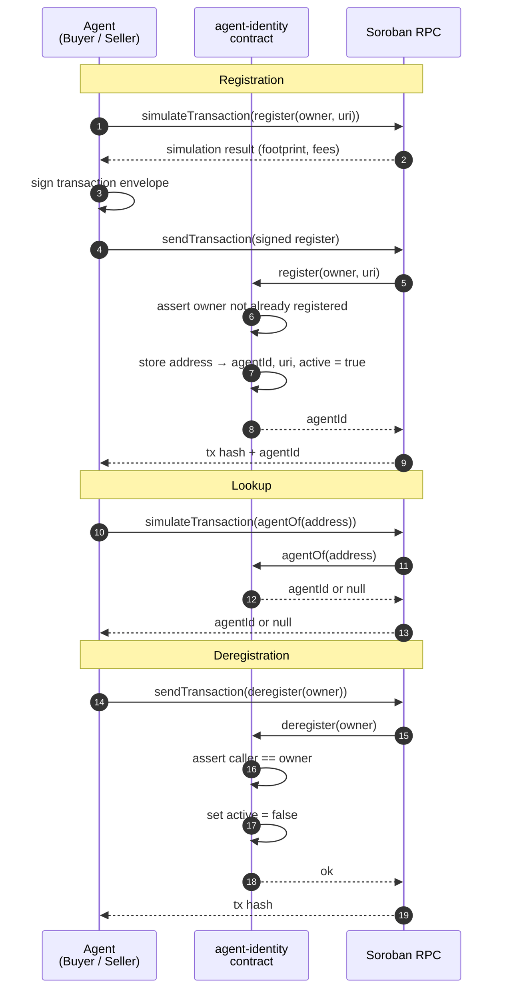

### Layer 2: Job Escrow Lifecycle

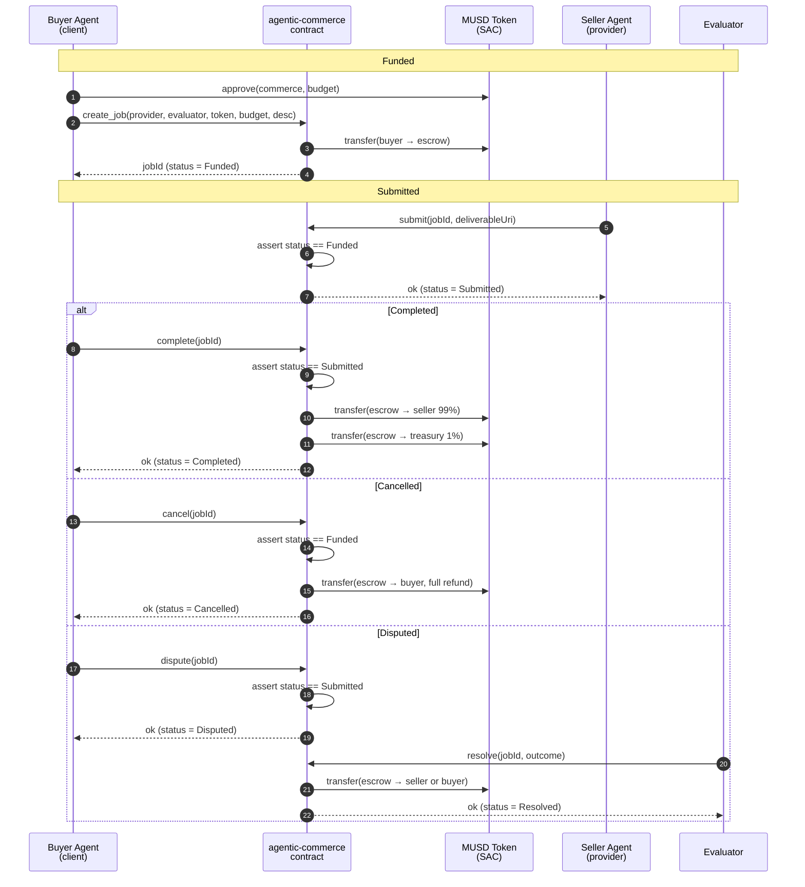

### Layer 3: HTTP 402 Micropayment Flow

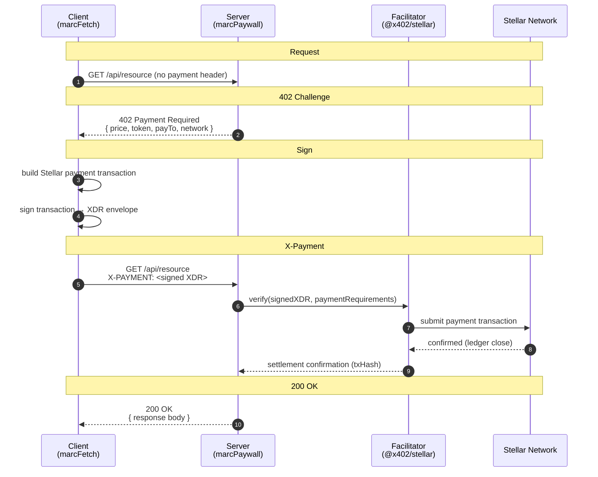

---

## Dependency Graph

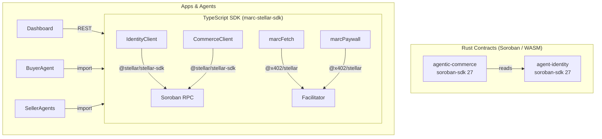

---

## Data Model

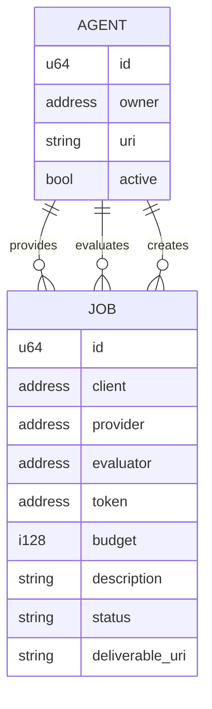

---

## Key Addresses (Testnet)

| Contract         | Address                                                    |
| ---------------- | ---------------------------------------------------------- |
| Agent Identity   | `CAMPXYFZJTIPEVOPOAZPRG5OHXKNBDPGTPRCOIO4LVPGEM4TONPY65A5` |
| Agentic Commerce | `CD2KWU7IE74Z2QKVP3FQ67J46XHNMGIDTNKXVWE7ZNVRC7T6UH46GQXE` |
| USDC (SAC)       | `CBIELTK6YBZJU5UP2WWQEUCYKLPU6AUNZ2BQ4WWFEIE3USCIHMXQDAMA` |

---

## Capability Tag Taxonomy

Agent manifests standardize capability metadata using an approved taxonomy (Issue #597) rather than arbitrary free-form strings. This allows buyer agents and discovery clients to reliably query and match service providers by capability.

The canonical taxonomy is defined in `agents/shared.ts` as `APPROVED_TAGS`:

```typescript
export const APPROVED_TAGS = [
  "webdev",
  "copywriting",
  "research",
  "naming",
  "translation",
  "data-analysis",
  "seo",
  "design",
] as const;
```

### Approved Taxonomy Reference

| Tag | Domain | Description | Typical Tasks |
| --- | ------ | ----------- | ------------- |
| `webdev` | Development | Web development, HTML/CSS generation, frontend UI | `build website`, `create landing page`, `build html page` |
| `copywriting` | Content | Marketing copy, headlines, body sections, CTAs | `write copy`, `write website copy`, `write tagline` |
| `research` | Intelligence | Topic investigation, market research, fact finding | `research`, `summarise topic`, `market research` |
| `naming` | Branding | Creative brand, company, and product naming | `generate names`, `brand naming`, `product naming` |
| `translation` | Language | Cross-language translation, localization | `translate document`, `localize copy` |
| `data-analysis` | Analytics | Quantitative summaries, data extraction, analysis | `analyze data`, `statistical report` |
| `seo` | Marketing | Keyword research, metadata generation, optimization | `seo audit`, `optimize keywords` |
| `design` | Creative | UI layout, CSS design specifications, styling | `design mockup`, `style guide` |

### Registry Validation

The agent registry (`agents/registry/server.ts`) enforces taxonomy compliance via `validateTags(tags: string[])`:
- Rejects or warns on unknown tags during heartbeat manifest verification.
- Normalized to lowercase trimmed strings.
- Filters queries on `GET /agents?tags=webdev,design` strictly against active provider capabilities.

